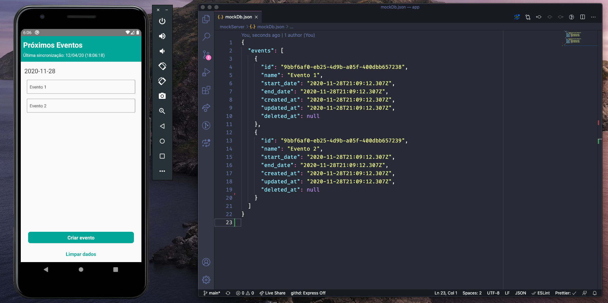

<h1 align="center">
<br>
  
<br>
<br>
Offline First no React Native - Exemplo Prático
</h1>

<p align="center">Projeto utilizado como exemplo na <a href="https://www.youtube.com/watch?v=N5s6ESYjSDk">live sobre Offline First</a> da WoMakersCode em parceria com a DTI digital.</p>

<hr />

## Features

As principais tecnologias utilizadas neste projeto foram:

- **[Realm Database](https://github.com/realm/realm-js)** — Biblioteca para implementar o banco de dados local do dispositivo
- **[React Native](https://reactnative.dev/)** — Bibliteca JS para a construção do aplicativo móvel
- **[JSON Server](https://github.com/typicode/json-server)** — Biblioteca para simular uma api utilizando um arquivo JSON

## Para executar o projeto

Entre na pasta raiz do projeto e instale as dependências:

```
npm install
```

Para executar a api mockada:

```
npm run mock-server
```

Finalmente, para executar o app:

- Emulador do Android:

  ```
  npx react-native run-android
  ```

- Emulador do iOS:

  ```
  npx react-native run-ios
  ```

Obs.: dependendo de qual emulador você esteja usando, talvez seja necessário alterar a URL base que se encontra no arquivo `services/api.js`.

```js
const apiService = axios.create({
  baseURL: 'http://localhost:3000/', // funciona no iOS
});

const apiService = axios.create({
  baseURL: 'http://10.0.2.2:3000/', // funciona no Android
});
```

## Observações

- Este exemplo usa apenas a abordagem de banco de dados local do Realm. Existe a possibilidade de utilizar o próprio serviço de sincronização que eles oferecem.

- A estrutura das funções de sincronização (pullChanges e pushChanges) foi baseada [na documentação de sincronização](https://nozbe.github.io/WatermelonDB/Advanced/Sync.html) de uma outra biblioteca para uso de banco de dados para aplicações mobile, a [WatermelonDB](https://github.com/Nozbe/WatermelonDB).

## Referências

- [Documentação sobre sincronização do WatermelonDB](https://nozbe.github.io/WatermelonDB/Advanced/Sync.html)
- [Projeto de exemplo de utilização do Realm feito pela equipe da MongoDB](https://github.com/mongodb-university/realm-tutorial-react-native)
- [Documentação antiga do Realm](https://realm.io/docs/javascript/latest)
- [Documentação nova do Realm (após ser adquirido pela MongoDB)](https://docs.mongodb.com/realm/)
